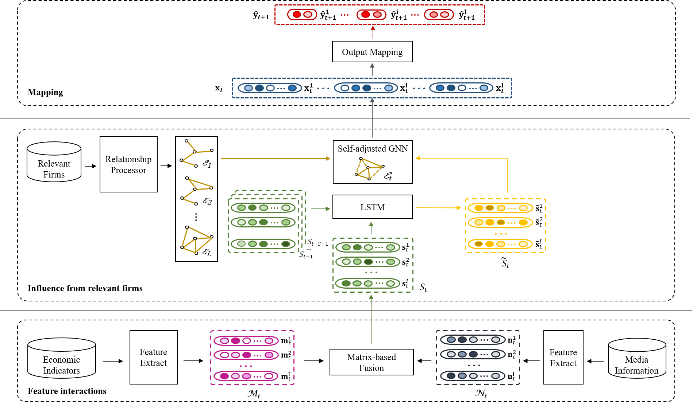

# Asset pricing via deep graph learning to incorporate heterogeneous predictors
This is the source code of our paper, 
named Asset pricing via deep graph learning to incorporate heterogeneous predictors

## Model architechture
 

## Overview
* `layers.py` contains two modules of the SA-GNN model: Node Representation (`MatrixFusionLayer`) and 
  Node Links (`ExplicitLayer`);
  
* `models.py` contains the SA-GNN model;

* `utils.py` contains data loading (`load_data`) 
  and evaluation metrics (`metrics`);

* `train_evaluation.py` puts all of the above together and is uesd to execute
a full training run on our dataset.

